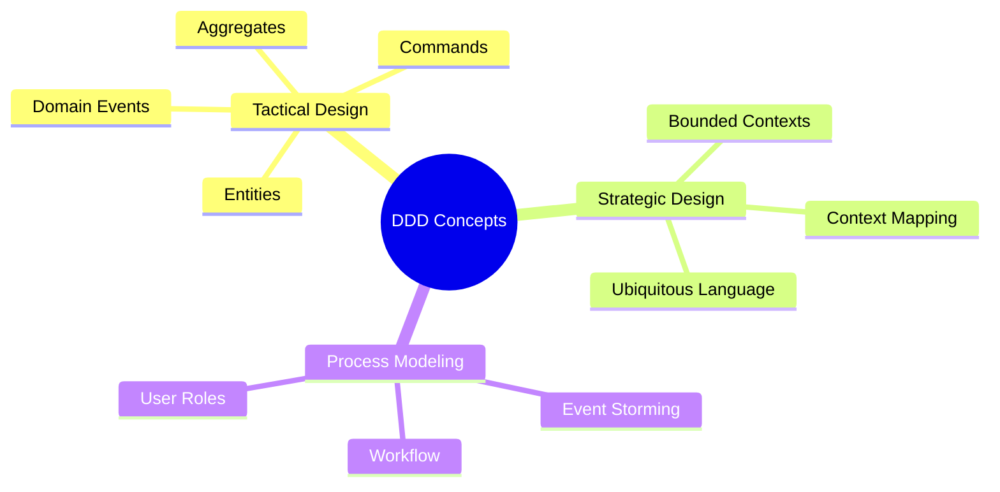
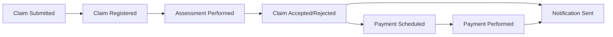

# Insurance Claim DDD Model

This repository contains Domain-Driven Design (DDD) models representing an insurance claim processing system, based on a modeling workshop session.

## Contents

- [Insurance Claim Processing Flow](ddd-insurance-claim-process.md) - The main process flow visualization
- [Domain Model](ddd-domain-model.md) - Details of aggregates, commands, events, and actors
- [Bounded Contexts](ddd-bounded-contexts.md) - Analysis of potential bounded contexts and their relationships

## About This Model

This model was created by extracting and documenting a diagram produced in a Domain-Driven Design modeling workshop. It shows the end-to-end process of insurance claim handling, from submission through assessment to payment or rejection.

## Key DDD Concepts Used

The model demonstrates several core DDD concepts:

## Quick Reference

### Domain Event Flow

### User Roles

- **Customer** - Submits claim and receives notifications
- **Administrator** - Verifies documentation completeness  
- **Claims Department Staff** - Performs assessment, makes decisions, schedules payments

## Next Steps

Potential next steps for this model:

1. Refine aggregate boundaries
2. Make decisions on bounded context integration patterns
3. Define services and repositories
4. Create detailed domain models within each bounded context 