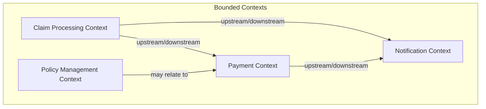

# Insurance Claim Domain Model

## Aggregates

### Claim
The central entity in the insurance claim process.

**States:**
- Submitted
- Registered 
- Assessed
- Accepted
- Rejected

**Commands:**
- Submit Claim
- Register Claim
- Assess Claim
- Accept Claim
- Reject Claim

**Events:**
- ClaimSubmitted
- ClaimRegistered
- AssessmentPerformed
- ClaimAccepted
- ClaimRejected

### Payment
Handles the payment processing for accepted claims.

**States:**
- Scheduled
- Performed

**Commands:**
- Schedule Payment
- Perform Payment

**Events:**
- PaymentScheduled
- PaymentPerformed

### Notification
Manages communication with customers.

**Commands:**
- Notify Customer

**Events:**
- CustomerNotified

## User Roles

### Customer
- Initiates the claim submission process
- Receives notifications about claim status

### Administrator
- Responsible for checking documentation completeness
- Registers valid claims in the system

### Claims Department Representative
- Performs claim assessment
- Makes decision to accept or reject claims
- Schedules payments for accepted claims

## Domain Events Flow

```mermaid
sequenceDiagram
    actor System
    actor Customer
    actor Administrator
    actor ClaimsRep
    
    Customer->>+System: Submit Claim
    System-->>-Customer: ClaimSubmitted
    
    Administrator->>+System: Check Documentation
    System-->>-Administrator: ClaimRegistered
    
    ClaimsRep->>+System: Check Insurance
    System-->>-ClaimsRep: AssessmentPerformed
    
    alt Claim Accepted
        ClaimsRep->>+System: Accept Claim & Schedule Payment
        System-->>-ClaimsRep: PaymentScheduled
        
        System->>+System: Perform Payment
        System-->>-System: PaymentPerformed
        
        System->>+Customer: Notify Customer
        System-->>-Customer: CustomerNotified
    else Claim Rejected
        ClaimsRep->>+System: Reject Claim
        System-->>-ClaimsRep: ClaimRejected
        
        System->>+Customer: Notify Customer
        System-->>-Customer: CustomerNotified
    end
```

## Context Mapping



## Domain Vocabulary

| Term | Definition |
|------|------------|
| Claim | A formal request by a policyholder for coverage or compensation for a covered loss or policy event |
| Assessment | Evaluation of a claim's validity and coverage under the policy terms |
| Payment | Transfer of funds to compensate the policyholder for a covered claim |
| Notification | Communication to the customer regarding claim status |
| Self-Service | Customer-initiated claim submission without agent assistance | 