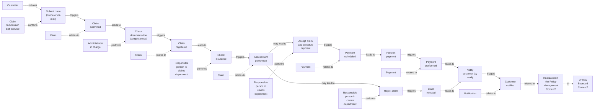

# Insurance Claim Processing - Domain Driven Design

## DDD Building Blocks

Key concepts from the DDD model:

| Color  | Concept      | Description                          |
|--------|-------------|--------------------------------------|
| Orange | Domain Event | Something that happened in the domain |
| Blue   | Command     | An action that changes state         |
| Yellow | Aggregate   | Cluster of domain objects treated as a unit |
| Pink   | Issue       | Problem or challenge in the domain   |
| Yellow with icon | User Role | Person who interacts with the system |

## Claim Processing Flow

## Bounded Contexts

The diagram suggests potential bounded contexts:

1. **Claim Processing Context** - Main process flow from submission to decision
2. **Payment Context** - Handling of payment scheduling and execution  
3. **Notification Context** - Customer communication
4. **Policy Management Context** - Referenced as a possible realization context

## Strategic Design Considerations

The diagram raises questions about where certain responsibilities should live:
- Should notification be part of the claim process or its own bounded context?
- Should payment be realized in the policy management context or a new bounded context?

These considerations help identify appropriate service boundaries in the system architecture. 