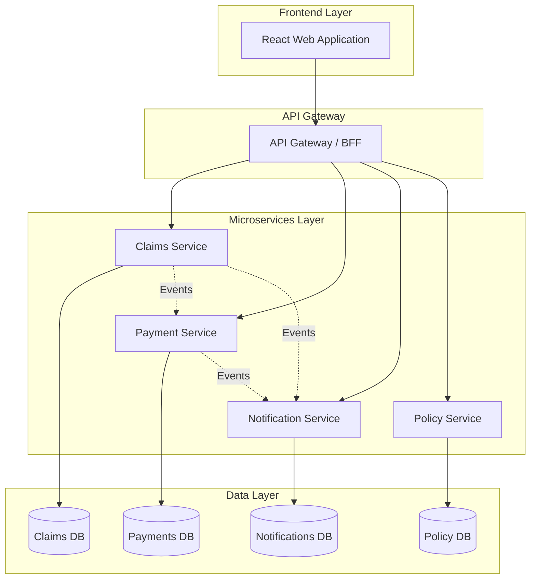
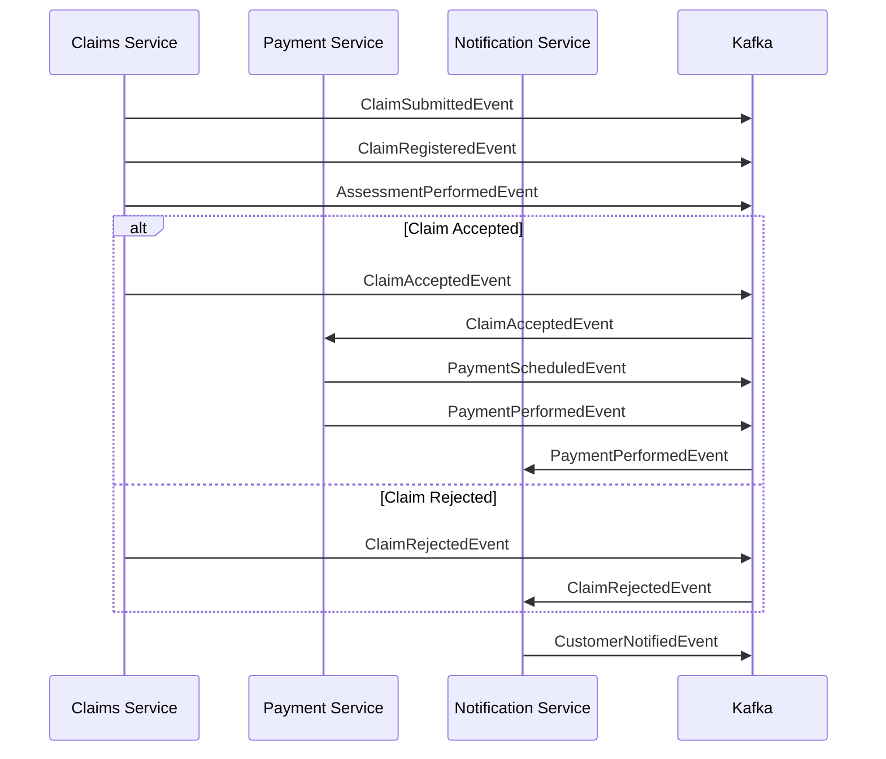
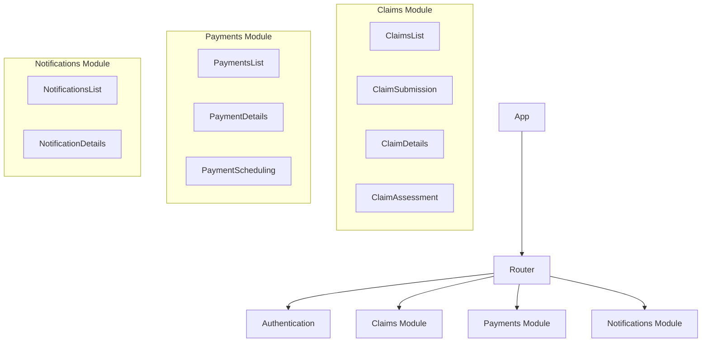
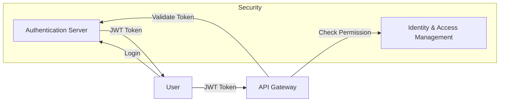
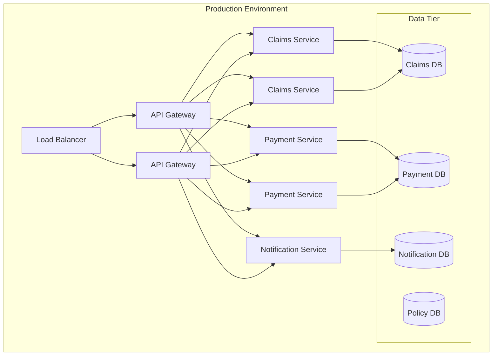

# Insurance Claim Processing System Architecture

This document outlines the system architecture for the Insurance Claim Processing System based on the Domain-Driven Design (DDD) modeling.

## System Overview

The system follows a microservices architecture aligned with the bounded contexts identified in the DDD modeling process:



## Technology Stack

### Backend
- **Framework**: Spring Boot 3.x
- **Communication**: REST APIs and Event-Driven Architecture using Spring Cloud Stream
- **Database**: 
  - PostgreSQL for transactional data
  - MongoDB for document storage (claim details, attachments metadata)
- **Message Broker**: Apache Kafka for event publishing
- **Security**: Spring Security with OAuth2/JWT
- **API Documentation**: OpenAPI (Swagger)
- **Container**: Docker
- **Orchestration**: Kubernetes

### Frontend
- **Framework**: React with TypeScript
- **State Management**: Redux Toolkit
- **UI Library**: Material-UI or Chakra UI
- **API Client**: Axios
- **Forms**: Formik with Yup validation
- **Testing**: Jest and React Testing Library

## Microservices Architecture

### 1. Claims Service

**Responsibilities:**
- Claim submission
- Documentation verification
- Insurance coverage verification
- Claim assessment
- Decision making (accept/reject)

**Domain Model:**

```java
@Aggregate
public class Claim {
    @AggregateId
    private UUID id;
    private String claimNumber;
    private UUID policyId;
    private UUID customerId;
    private ClaimStatus status;
    private LocalDateTime submissionDate;
    private List<Document> documents;
    private AssessmentResult assessment;
    
    // Methods that handle commands and emit events
    public ClaimSubmittedEvent submit() { /* ... */ }
    public ClaimRegisteredEvent register() { /* ... */ }
    public AssessmentPerformedEvent assess(AssessmentResult result) { /* ... */ }
    public ClaimAcceptedEvent accept() { /* ... */ }
    public ClaimRejectedEvent reject(String reason) { /* ... */ }
}

public enum ClaimStatus {
    SUBMITTED, REGISTERED, ASSESSED, ACCEPTED, REJECTED
}
```

**API Endpoints:**
- `POST /api/claims` - Submit new claim
- `GET /api/claims` - List claims (with filters)
- `GET /api/claims/{id}` - Get claim details
- `PUT /api/claims/{id}/register` - Register claim
- `PUT /api/claims/{id}/assess` - Submit assessment
- `PUT /api/claims/{id}/accept` - Accept claim
- `PUT /api/claims/{id}/reject` - Reject claim

### 2. Payment Service

**Responsibilities:**
- Payment scheduling
- Payment execution
- Payment status tracking

**Domain Model:**

```java
@Aggregate
public class Payment {
    @AggregateId
    private UUID id;
    private UUID claimId;
    private UUID customerId;
    private BigDecimal amount;
    private PaymentStatus status;
    private LocalDateTime scheduledDate;
    private LocalDateTime executionDate;
    private String paymentMethod;
    
    // Methods that handle commands and emit events
    public PaymentScheduledEvent schedule() { /* ... */ }
    public PaymentPerformedEvent perform() { /* ... */ }
}

public enum PaymentStatus {
    SCHEDULED, PERFORMED, FAILED
}
```

**API Endpoints:**
- `POST /api/payments` - Schedule payment
- `GET /api/payments` - List payments (with filters)
- `GET /api/payments/{id}` - Get payment details
- `PUT /api/payments/{id}/execute` - Execute payment

### 3. Notification Service

**Responsibilities:**
- Sending notifications to customers
- Maintaining communication history
- Formatting messages appropriately

**Domain Model:**

```java
@Aggregate
public class Notification {
    @AggregateId
    private UUID id;
    private UUID recipientId;
    private UUID relatedEntityId; // claimId or paymentId
    private NotificationType type;
    private String channel; // email, sms, mail
    private String content;
    private NotificationStatus status;
    private LocalDateTime sentDate;
    
    // Methods
    public CustomerNotifiedEvent send() { /* ... */ }
}

public enum NotificationType {
    CLAIM_SUBMITTED, CLAIM_ACCEPTED, CLAIM_REJECTED, PAYMENT_PERFORMED
}

public enum NotificationStatus {
    PENDING, SENT, FAILED
}
```

**API Endpoints:**
- `POST /api/notifications` - Create notification
- `GET /api/notifications` - List notifications (with filters)
- `GET /api/notifications/{id}` - Get notification details
- `PUT /api/notifications/{id}/send` - Send notification

### 4. Policy Service

**Responsibilities:**
- Policy data retrieval
- Coverage verification
- Premium management

**API Endpoints:**
- `GET /api/policies/{id}` - Get policy details
- `GET /api/policies/{id}/coverage` - Get coverage details
- `GET /api/policies/{id}/validity` - Check policy validity

## Event-Driven Communication

The system uses an event-driven architecture to communicate between services:



## Frontend Architecture

The React application is organized around the different bounded contexts:



### Key UI Components

#### Customer Portal
- Claim submission form
- Claim status tracker
- Document upload
- Payment status view
- Notification inbox

#### Administrator Dashboard
- Document verification queue
- Claim registration interface

#### Claims Department Interface
- Claim assessment dashboard
- Decision making interface (accept/reject)
- Payment scheduling

## API Gateway / Backend for Frontend (BFF)

The API Gateway serves as an entry point for frontend applications and provides:

- Request routing to appropriate microservices
- Authentication and authorization
- Request/response transformation
- Rate limiting
- API documentation aggregation

## Security Architecture



- **Authentication**: JWT-based authentication
- **Authorization**: Role-based access control (RBAC)
- **Roles**:
  - Customer
  - Administrator
  - Claims Department Representative
  - System

## Deployment Architecture



- **Containerization**: Each microservice is packaged as a Docker container
- **Orchestration**: Kubernetes for container orchestration
- **CI/CD**: Jenkins or GitHub Actions pipeline for automated building, testing and deployment
- **Monitoring**: Prometheus for metrics collection and Grafana for visualization
- **Logging**: ELK stack (Elasticsearch, Logstash, Kibana)

## Bounded Context Integration

The integration between bounded contexts is achieved through:

1. **Event-Driven Integration**: Services publish domain events that other services can subscribe to
2. **API Integration**: Synchronous API calls between services for critical operations
3. **Shared Kernel**: Minimal shared libraries for common concepts and utilities

## Implementation Guidelines

### Domain-Driven Design Implementation

- **Aggregate Roots**: Implement as JPA entities with proper encapsulation
- **Value Objects**: Implement as immutable objects
- **Domain Events**: Use Spring's ApplicationEventPublisher for local events and Kafka for cross-service events
- **Commands**: Implement command handlers using Spring's command pattern or CQRS
- **Repositories**: Use Spring Data repositories

### Coding Standards

- Follow clean code principles
- Implement comprehensive test coverage (unit, integration, and end-to-end)
- Apply SOLID principles
- Document APIs using OpenAPI
- Implement proper error handling and validation

## Future Considerations

1. **Scalability**: Design services to scale horizontally
2. **Resilience**: Implement circuit breakers, retries, and fallbacks
3. **Performance**: Cache frequently accessed data
4. **Monitoring**: Set up comprehensive monitoring and alerting
5. **Analytics**: Implement a data warehouse for business intelligence
6. **Mobile Support**: Extend the frontend to support mobile applications 