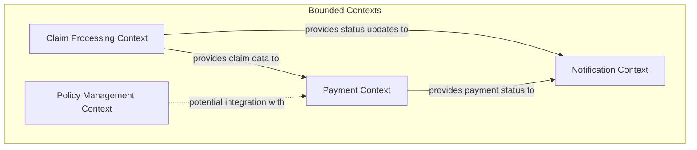
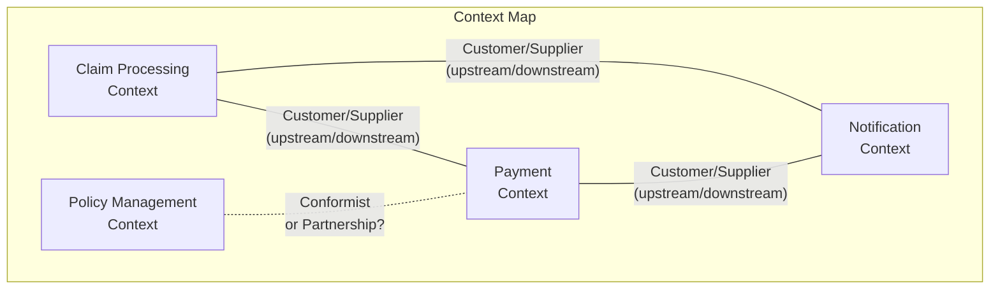
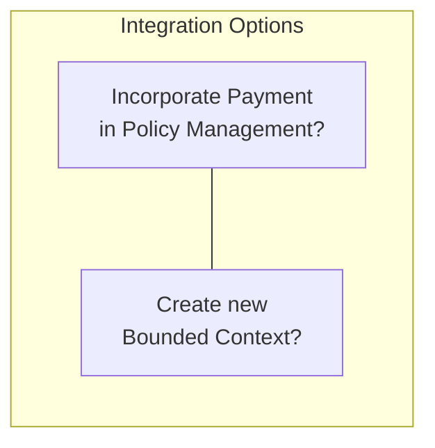

# Insurance Claim Processing - Bounded Contexts

This document describes the identified bounded contexts within the insurance claim processing domain and their relationships.

## Identified Bounded Contexts

## Context Descriptions

### Claim Processing Context
The core domain responsible for handling claim submissions, validations, and underwriting decisions.

**Responsibilities:**
- Claim submission (self-service or mail)
- Documentation verification
- Insurance coverage verification
- Claim assessment
- Decision making (accept/reject)

**Aggregates:**
- Claim
- ClaimSubmission
- Assessment

**Domain Events:**
- ClaimSubmitted
- ClaimRegistered
- AssessmentPerformed
- ClaimAccepted
- ClaimRejected

### Payment Context
Handles everything related to payment processing for accepted claims.

**Responsibilities:**
- Payment scheduling
- Payment execution
- Payment status tracking

**Aggregates:**
- Payment

**Domain Events:**
- PaymentScheduled
- PaymentPerformed

### Notification Context
Manages communication with stakeholders.

**Responsibilities:**
- Sending notifications to customers
- Maintaining communication history
- Formatting messages appropriately

**Aggregates:**
- Notification

**Domain Events:**
- CustomerNotified

### Policy Management Context
Existing context that may relate to payment processing.

**Responsibilities:**
- Policy data storage
- Coverage details
- Premium management

## Context Relationships

## Integration Considerations

### Integration Patterns
The diagram raises strategic design questions about integration patterns:

### Design Decisions
1. **Payment Processing**: Should this be part of the Policy Management Context or exist as a separate bounded context?
   - Pro for separate: Specialized payment concerns can evolve independently
   - Pro for integrated: Simplified architecture if payment is tightly coupled to policy

2. **Notification Handling**: Should this be a separate context or part of the claim process?
   - Pro for separate: Can serve multiple domains (claims, policy updates, etc.)
   - Pro for integrated: Simpler if notifications are only claim-related 