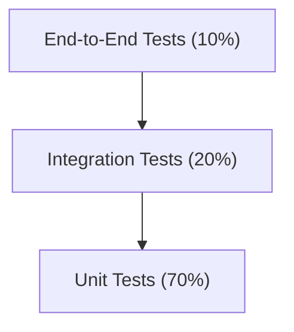

# Testing Strategy

This document outlines our approach to testing the Insurance Claim Processing System, ensuring both technical quality and domain correctness.

## Testing Pyramid

We follow a testing pyramid approach with emphasis on unit tests and appropriate coverage at each level:



## Test Types and Responsibilities

### Unit Tests

**Target: 80% code coverage**

Unit tests focus on testing isolated components of the system, particularly the domain model and business logic.

**Key areas to test:**
- Domain entities and value objects
- Aggregate behaviors and business rules
- Domain services

**Example:**
```java
@Test
void shouldRejectClaimWhenPolicyIsExpired() {
    // Given
    Policy expiredPolicy = new Policy(PolicyStatus.EXPIRED);
    Claim claim = new Claim(CLAIM_ID, expiredPolicy.getId());
    
    // When
    ClaimRejectedEvent event = claim.assess(new AssessmentResult(false, "Policy expired"));
    
    // Then
    assertEquals(ClaimStatus.REJECTED, claim.getStatus());
    assertEquals("Policy expired", event.getReason());
}
```

### Integration Tests

**Target: Key integration points covered**

Integration tests verify that components work together correctly across layers and with external dependencies.

**Key areas to test:**
- API controllers with mock services
- Repository implementations with test databases
- Event producers and consumers
- Cross-service communication

**Example:**
```java
@SpringBootTest
@AutoConfigureMockMvc
class ClaimControllerIntegrationTest {
    @Autowired
    private MockMvc mockMvc;
    
    @MockBean
    private ClaimService claimService;
    
    @Test
    void shouldAcceptValidClaim() throws Exception {
        // Given
        ClaimDTO claimDTO = new ClaimDTO(/* ... */);
        when(claimService.processClaim(any())).thenReturn(/* ... */);
        
        // When/Then
        mockMvc.perform(post("/api/claims")
                .contentType(MediaType.APPLICATION_JSON)
                .content(objectMapper.writeValueAsString(claimDTO)))
                .andExpect(status().isCreated())
                .andExpect(jsonPath("$.status").value("SUBMITTED"));
    }
}
```

### End-to-End Tests

**Target: Critical business workflows covered**

End-to-end tests verify complete business flows from UI interaction to database changes.

**Key areas to test:**
- Complete claim submission flow
- Claim assessment and payment processing
- Notification delivery

**Example using Cucumber:**
```gherkin
Feature: Claim Submission

Scenario: Customer submits a valid claim
  Given a customer with an active policy
  When they submit a claim with all required documents
  Then the claim should be registered in the system
  And the customer should receive a confirmation notification
```

## Domain-Specific Testing Approaches

### Business Rule Testing

For every business rule identified in the domain model, create specific tests that verify the rule under various conditions.

**Approach:**
1. Identify business rules during domain modeling
2. Create a test class for each aggregate that tests all associated rules
3. Use descriptive test names that map to business language

### Event Flow Testing

Verify that domain events flow correctly between contexts.

**Approach:**
1. Use integration tests with embedded Kafka for event producers and consumers
2. Verify that domain events trigger appropriate actions in consuming services
3. Test replay and error-handling capabilities

**Example:**
```java
@Test
void shouldSchedulePaymentWhenClaimAccepted() {
    // Given
    ClaimAcceptedEvent event = new ClaimAcceptedEvent(CLAIM_ID, AMOUNT);
    
    // When
    claimEventListener.handleClaimAccepted(event);
    
    // Then
    verify(paymentService).schedulePayment(
        argThat(payment -> payment.getClaimId().equals(CLAIM_ID) && 
                          payment.getAmount().equals(AMOUNT))
    );
}
```

## Test Environments

### Local Development
- Docker Compose for infrastructure dependencies
- H2 or TestContainers for database tests
- Embedded Kafka for event testing

### CI Pipeline
- Dedicated test databases
- Kafka test cluster
- Mock external services

### Pre-Production
- Clone of production environment with anonymized data
- Performance and load testing
- Data migration testing

## Tools and Frameworks

- **Unit Testing**: JUnit 5, Mockito
- **Integration Testing**: Spring Boot Test, TestContainers
- **API Testing**: REST Assured
- **UI Testing**: Jest, React Testing Library, Cypress
- **BDD Testing**: Cucumber
- **Performance Testing**: JMeter, Gatling
- **Code Coverage**: JaCoCo
- **Mutation Testing**: PIT

## Testing Best Practices

1. **Follow AAA Pattern**: Arrange, Act, Assert
2. **Test Business Outcomes**: Focus on behavior, not implementation
3. **Use Domain Language**: Test names and comments should reflect business concepts
4. **Property-Based Testing**: For complex business rules with many edge cases
5. **Test Edge Cases**: Explicitly test boundary conditions
6. **Avoid Test Duplication**: Extract common setup into fixtures or helpers
7. **Keep Tests Independent**: One test should not depend on another

## Testing in the Development Process

- **TDD Approach**: Write tests before implementation for complex domain logic
- **PR Requirements**: No PR will be merged without passing tests and meeting coverage requirements
- **Regression Testing**: Automated execution of all tests before release
- **Test Documentation**: Use BDD-style tests as living documentation of system behavior

## Monitoring Test Health

- **Flaky Test Detection**: Track tests that intermittently fail
- **Coverage Trends**: Monitor coverage trends over time
- **Test Execution Time**: Optimize slow-running tests

## Responsibility Matrix

| Test Type | Who Writes | Who Reviews | When Run |
|-----------|------------|-------------|----------|
| Unit Tests | Developers | Peer Developers | On each commit |
| Integration Tests | Developers | Senior Developers | On PR and nightly |
| API Contract Tests | API Developers | API Consumers | On PR and nightly |
| E2E Tests | QA Engineers + Developers | Domain Experts | Nightly and pre-release |
| Performance Tests | Performance Engineers | Architects | Weekly and pre-release | 