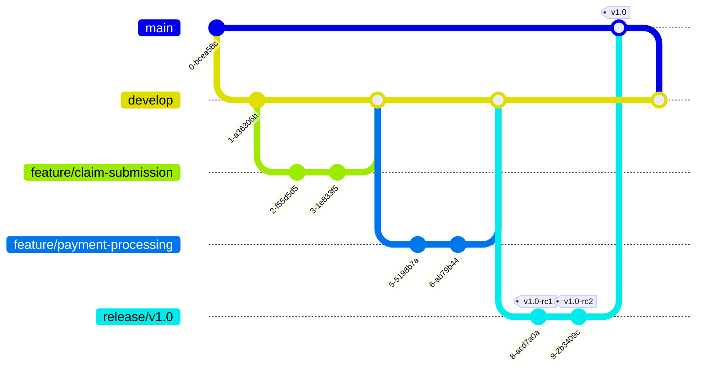
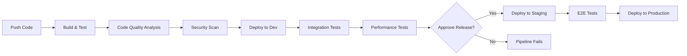

# Engineering Workflow

This document outlines our Git workflow, PR process, and overall engineering practices for the Insurance Claim Processing System.

## Git Workflow

We follow a modified GitFlow workflow with the following branches:



### Branch Types

- **main**: Production code
- **develop**: Integration branch for development
- **feature/xxx**: Feature branches
- **fix/xxx**: Bug fix branches
- **release/vX.Y.Z**: Release preparation
- **hotfix/xxx**: Urgent production fixes

### Branch Naming Conventions

- Feature branches: `feature/[bounded-context]-[short-description]` (e.g., `feature/claims-file-upload`)
- Fix branches: `fix/[issue-number]-[short-description]` (e.g., `fix/123-claim-validation-bug`)
- Hotfix branches: `hotfix/[issue-number]-[short-description]` (e.g., `hotfix/145-security-vulnerability`)
- Release branches: `release/v[X.Y.Z]` (e.g., `release/v1.2.0`)

## Commit Messages

We follow the [Conventional Commits](https://www.conventionalcommits.org/) specification:

```
<type>[optional scope]: <description>

[optional body]

[optional footer(s)]
```

### Types

- **feat**: A new feature
- **fix**: A bug fix
- **docs**: Documentation changes
- **style**: Code style changes (formatting, etc.)
- **refactor**: Code changes that neither fix bugs nor add features
- **test**: Adding or correcting tests
- **chore**: Changes to the build process, tools, etc.

### Scopes

Scopes should typically reference the affected bounded context or component:

- **claims**
- **payments**
- **notifications**
- **policy**
- **ui**
- **infra**
- **ci**

### Examples

```
feat(claims): add document upload functionality

Implement file upload for claim documents with the following features:
- Support for PDF, JPG, and PNG files
- Max file size validation
- Virus scanning integration

Closes #123
```

```
fix(payments): correct payment calculation for multi-policy claims

The payment amount was incorrectly calculated when a claim spans
multiple policies. This fix ensures we aggregate coverage correctly.

Fixes #456
```

## Pull Request Process

### Creating a PR

1. Create a PR from your feature branch to the `develop` branch
2. Use the PR template
3. Assign appropriate reviewers:
   - At least one domain expert
   - At least one technical reviewer
4. Link the related issue(s)
5. Ensure all checks pass

### PR Reviews

Every PR must be reviewed for:

1. **Domain Correctness**: Does the code correctly implement the domain concepts?
2. **Technical Quality**: Is the code well-written, tested, and maintainable?
3. **DDD Compliance**: Does it follow our DDD principles?

### PR Approval Requirements

- At least 2 approvals required
- All automated checks must pass
- No unresolved comments

### Merging

- Only use "Squash and Merge" to keep history clean
- Update the PR title to match the conventional commit format before merging
- Delete branches after merging

## CI/CD Pipeline



### Pipeline Stages

1. **Build & Test**: Compile code and run unit tests
2. **Code Quality Analysis**: Run SonarQube analysis
3. **Security Scan**: Run dependency and code security scans
4. **Deploy to Dev**: Automatic deployment to development environment
5. **Integration Tests**: Run integration test suite
6. **Performance Tests**: Run performance benchmarks
7. **Deploy to Staging**: Deployment to staging environment
8. **E2E Tests**: Run end-to-end test suite
9. **Deploy to Production**: Manual approval and deployment to production

## Release Process

1. Create a release branch `release/vX.Y.Z` from `develop`
2. Make only bug fixes and documentation changes in the release branch
3. Deploy to a staging environment for final testing
4. When ready, merge to `main` and tag with version number
5. Merge `main` back to `develop`

### Version Numbering

We follow [Semantic Versioning](https://semver.org/):

- **MAJOR**: Incompatible API changes
- **MINOR**: Backwards-compatible functionality additions
- **PATCH**: Backwards-compatible bug fixes

## Issue Tracking

- All work must be linked to an issue
- Issues should include:
  - User story or bug description
  - Acceptance criteria
  - Technical specifications (if applicable)
  - References to domain concepts

## Code Quality Standards

- All code must pass linting rules
- 80% unit test coverage minimum
- SonarQube quality gate must pass
- No critical or high security vulnerabilities
- Documentation for all public APIs

## Collaboration Practices

- Daily standup at 10:00 AM
- Weekly technical refinement at 11:00 AM on Tuesdays
- Bi-weekly sprint planning on Mondays
- Monthly architecture review
- Pair programming encouraged for complex domain logic 