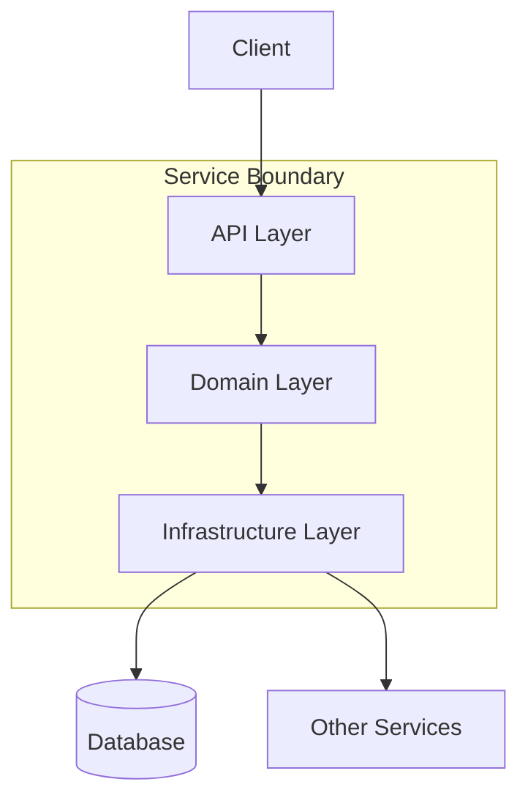
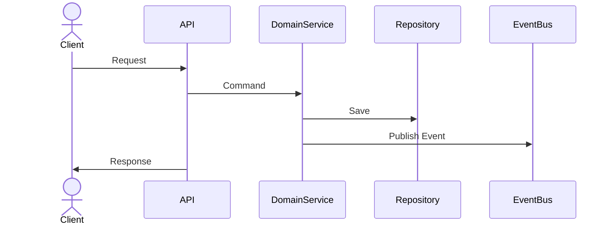

# Technical Design Document: [Service Name]

## 1. Overview

### 1.1 Purpose
[Describe the purpose of this service in relation to the bounded context it addresses]

### 1.2 Scope
[Define the scope of this service - what it does and doesn't do]

### 1.3 Related Bounded Contexts
[List the bounded contexts this service interacts with]

## 2. Domain Model

### 2.1 Aggregates
[Describe the main aggregates managed by this service]

### 2.2 Entities
[List and describe the key entities]

### 2.3 Value Objects
[List and describe the value objects]

### 2.4 Domain Events
[List and describe the domain events produced by this service]

## 3. Architecture

### 3.1 Component Diagram
[Include a component diagram showing the internal structure]



### 3.2 Data Model
[Describe the data model, including tables, collections, etc.]

### 3.3 APIs
[Document the APIs exposed by this service]

| Endpoint | Method | Description | Request | Response |
|----------|--------|-------------|---------|----------|
| `/api/resource` | GET | Description | N/A | 200 OK: Resource |

### 3.4 Event Publishing/Subscription
[Document the events published and subscribed to]

| Event | Direction | Description | Schema |
|-------|-----------|-------------|--------|
| `ClaimAccepted` | Published | Emitted when a claim is accepted | Link to schema |

## 4. Implementation Details

### 4.1 Technology Stack
- Language: Java 17
- Framework: Spring Boot 3.x
- Build Tool: Maven
- Database: [PostgreSQL/MongoDB]
- Event Bus: Kafka

### 4.2 Key Libraries
[List the key libraries and their purposes]

### 4.3 Package Structure
```
com.insurance.service/
├── api/                 # API controllers
├── domain/              # Domain model and logic
│   ├── model/           # Aggregates, entities, value objects
│   ├── service/         # Domain services
│   └── event/           # Domain events
├── infrastructure/      # Infrastructure concerns
│   ├── persistence/     # Repository implementations
│   ├── messaging/       # Event publishing/subscription
│   └── client/          # Client code for other services
└── application/         # Application services
```

## 5. Behavior

### 5.1 Key Workflows
[Describe the key workflows implemented by this service]



### 5.2 Business Rules
[Document key business rules implemented in this service]

## 6. Cross-Cutting Concerns

### 6.1 Security
[Describe security considerations]

### 6.2 Error Handling
[Describe error handling approach]

### 6.3 Logging
[Describe logging approach]

### 6.4 Monitoring
[Describe monitoring and observability approach]

## 7. Testing Strategy

### 7.1 Unit Tests
[Describe unit testing approach]

### 7.2 Integration Tests
[Describe integration testing approach]

### 7.3 Contract Tests
[Describe contract testing approach]

## 8. Deployment

### 8.1 CI/CD Pipeline
[Describe the CI/CD pipeline for this service]

### 8.2 Resource Requirements
[Document CPU, memory, storage requirements]

### 8.3 Configuration
[Document configuration parameters]

## 9. Risks and Mitigations

[Document identified risks and mitigation strategies]

| Risk | Impact | Likelihood | Mitigation |
|------|--------|------------|------------|
| Risk | High/Medium/Low | High/Medium/Low | Strategy |

## 10. Open Questions

[Document any open questions or decisions that need to be made] 